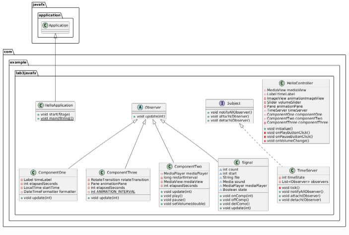

# Лабораторная работа: Наблюдатель (7)

## Описание проекта
Этот проект представляет собой медиаплеер, разработанный с использованием JavaFX.
Приложение позволяет пользователю воспроизводить видео, управлять громкостью, отслеживать время
с помощью таймера и наблюдать за анимацией. Проект демонстрирует использование паттерна "Наблюдатель"
для синхронизации компонентов.

## Функциональность
* Воспроизведение видео: Пользователь может воспроизводить и приостанавливать видео.
* Управление громкостью: Пользователь может регулировать громкость с помощью слайдера.
* Таймер: Приложение отображает время, прошедшее с момента запуска.
* Анимация: В приложении реализована анимация, которая запускается через заданные интервалы времени.
* Синхронизация компонентов: Используется паттерн "Наблюдатель" для синхронизации работы таймера, видео и анимации.

## Требования
* Java 11 или выше
* JavaFX SDK

## Основные компоненты
* `HelloApplication`: Отвечает за запуск приложения и загрузку интерфейса.
* `HelloController`: Управляет логикой приложения, обрабатывает пользовательский ввод и взаимодействует с компонентами.
* `TimeServer`: Реализует паттерн "Наблюдатель" для уведомления компонентов об изменении времени.
* `ComponentOne`: Отображает текущее время, прошедшее с момента запуска.
* `ComponentTwo`: Управляет воспроизведением видео и его перезапуском через заданные интервалы.
* `ComponentThree`: Реализует анимацию, которая запускается через заданные интервалы времени.
* `Subject` и `Observer`: Интерфейсы для реализации паттерна "Наблюдатель".

## Структура проекта
```
src
└── main
    ├── java
    │   └── com.example.lab3javafx
    │       ├── HelloApplication.java         # Основной класс приложения
    │       ├── HelloController.java          # Контроллер
    │       ├── TimeServer.java               # Сервер времени, реализующий паттерн "Наблюдатель"
    │       ├── ComponentOne.java             # Компонент для отображения времени
    │       ├── ComponentTwo.java             # Компонент для управления видео
    │       ├── ComponentThree.java           # Компонент для анимации
    │       ├── Subject.java                  # Интерфейс для субъекта в паттерне "Наблюдатель"
    │       └── Observer.java                 # Интерфейс для наблюдателя в паттерне "Наблюдатель"
    └── resources
        └── com.example.lab3javafx
            └── hello-view.fxml               # Файл FXML, описывающий пользовательский интерфейс
```

## Архитектура
